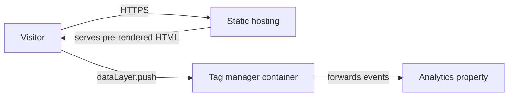
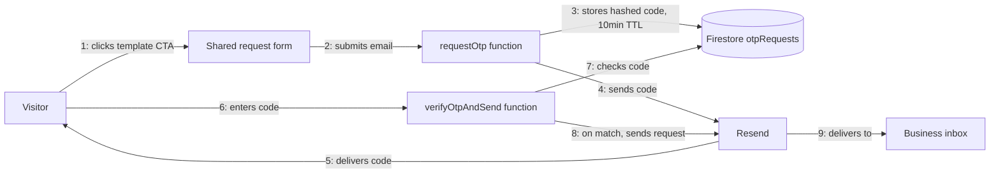

# Architecture

## Build status

| Component | Status |
|---|---|
| Static site (routes, content, SEO/GEO) | Built, deployed, live in production |
| GTM/GA4 analytics | Built and validated via GTM Preview mode against real fired tags |
| Template-request email flow (OTP + send) | Built, deployed, confirmed working end to end in production |

## Static site

Every route is pre-rendered HTML at build time, served directly by the hosting layer with no
server-side rendering and no API calls on the critical path. The tag-manager script loads
client-side and reads `dataLayer` events pushed by the page (page-view render-mode signal,
scroll-depth thresholds) and forwards them to the analytics property.

## Template-request email flow

- **Form** — one shared request form (not per-card), carries the selected template's name as
  submitted state.
- **requestOtp** — 2nd-gen Firebase Function (`europe-west1`), generates a 6-digit code, stores
  it SHA-256 hashed (never in plaintext) with a 10-minute TTL and a 60-second resend cooldown,
  triggers delivery via Resend.
- **Firestore `otpRequests`** — holds only the hashed code and its expiry against a hashed
  version of the submitted email, nothing else persisted. Fully denied to client reads/writes,
  Admin SDK only. TTL policy on `expiresAt` handles expiry cleanup automatically.
- **verifyOtpAndSend** — a second Function checks the submitted code against the store (5-attempt
  cap before a code is invalidated); only on a match does it send the actual template-request
  email, with the visitor's address set as reply-to.
- **Resend** — third-party transactional email provider, sending domain isolated to its own
  Resend team, separate from any other project's email sending.

Both functions run behind Firebase App Check (reCAPTCHA Enterprise), domain-scoped to the real
production domain. No login exists on the site, so App Check is the actual abuse gate: a request
that doesn't carry a valid App Check token for an authorized domain never reaches the function
code at all.

No real hostnames, endpoints, or credentials are recorded in this repo. See `SECURITY.md` for
how secrets are actually handled, and `FIREBASE-WORKFLOW.md` for how to deploy changes to this
flow or rotate its secrets going forward.
