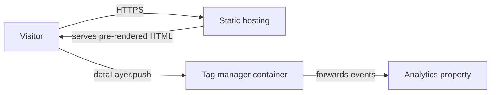
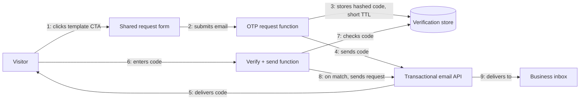

# Architecture

## Build status

| Component | Status |
|---|---|
| Static site (routes, content, SEO/GEO) | Built and verified locally, not deployed |
| GTM/GA4 analytics | Built and verified locally (dataLayer inspection), not validated against live traffic |
| Template-request email flow (OTP + send) | **Planned, not built.** Described below as the intended design — no code exists for this yet |

## Current system — static site

The site is a static export — every route is pre-rendered HTML at build time, served directly
by the hosting layer with no server-side rendering and no API calls on the critical path. The
tag-manager script loads client-side and reads `dataLayer` events pushed by the page (page-view
render-mode signal, scroll-depth thresholds) and forwards them to the analytics property.

## Planned system — template-request email flow

**Not yet built.** Documented here for review before implementation starts.

- **Form** — one shared request form (not per-card), carries the selected template's name as
  submitted state.
- **OTP request function** — serverless function, generates a short-lived one-time code, stores
  it hashed (never in plaintext) with a short expiry, triggers delivery.
- **Verification store** — holds only the hashed code and its expiry against the submitted
  email; nothing else persisted at this stage.
- **Verify + send function** — a second serverless function checks the submitted code against
  the store; only on a match does it send the actual template-request email, with the visitor's
  address set as reply-to.
- **Transactional email API** — third-party provider, not self-hosted.

No real hostnames, endpoints, or credentials are recorded in this repo. See `SECURITY.md` for
how secrets are actually handled once this is built.
